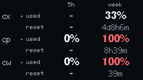

# M5Stick AI usage

[](https://github.com/hu553in/m5stick-ai-usage/actions/workflows/ci.yml)

Codex and Claude usage-limit monitor for M5StickC Plus2. Shows used quota and time until reset for
up to three accounts, with separate five-hour and weekly windows. A local Mac bridge reads the
accounts through [ai-usagebar](https://github.com/akitaonrails/ai-usagebar) and sends snapshots to
the display over Wi-Fi.

<p align="center">
  
</p>

## Requirements

- M5StickC Plus2, a USB data cable for flashing and provisioning, and a 2.4 GHz Wi-Fi network.
- A Mac with ai-usagebar installed and authenticated for the accounts to display.
- [uv](https://docs.astral.sh/uv/getting-started/installation/),
  [Bun](https://bun.sh/docs/installation), Node.js 24.11 or later within the 24.x line, Make and
  Clang. On macOS, install the Xcode Command Line Tools with `xcode-select --install`. Linux
  development checks require `clang` and `build-essential` on Debian/Ubuntu; the launch agent is
  macOS-specific.

## Setup

```sh
make install-deps
uv run --locked python scripts/create_config.py --list-accounts
```

The installer uses `uv.lock` and `bun.lock` for Python and JS dependencies, then installs the
PlatformIO packages. uv selects Python from `pyproject.toml`.

Choose account IDs from the list. `openai` and `anthropic` are listed even if the corresponding
provider is not logged in. Named Claude accounts must exist in ai-usagebar's configuration:

```sh
uv run --locked python scripts/create_config.py --ssid 'YOUR_WIFI_NAME' \
  --account 'openai=o1' --account 'anthropic@YOUR_ACCOUNT=a1'
```

Replace `YOUR_ACCOUNT` with a listed name. Setup prompts for the Wi-Fi password, detects the Mac's
Bonjour hostname and creates private local config files. Existing Wi-Fi credentials and the device
token are retained unless explicitly changed. To replace the account list later, repeat `--account`
for every desired row and omit `--ssid`.

Use `--source-config PATH` for an ai-usagebar config outside its standard location and `--host HOST`
to override hostname detection. To store this project's configuration elsewhere, pass
`--config /path/to/bridge.json`; generated files and `device.json` live beside it. Pass the same
bridge config path to the service installer and hardware checker. For `device.py`, `--config`
selects **device.json** instead.

The bridge config cannot use the generated names `device.json`, `ai-usagebar.toml`, `snapshot.json`
or their `.tmp` names, regardless of case. The original ai-usagebar config must be separate from
this project's config, generated files and their `.tmp` paths. Setup and bridge startup reject
conflicting paths before writing files.

## Configuration

[config.example.json](config.example.json) shows the editable settings with fictional account names.
Actual settings live outside the checkout in `~/.config/m5stick-ai-usage/`:

| File               | Contents                                                                                      |
| ------------------ | --------------------------------------------------------------------------------------------- |
| `bridge.json`      | Selected accounts, labels, network binding, polling, display preferences and access token     |
| `device.json`      | Wi-Fi credentials, bridge hostname, port and token; provisioned into device NVS over USB      |
| `ai-usagebar.toml` | Generated source selection referencing existing credentials; the original config is untouched |
| `snapshot.json`    | Last known quotas retained across bridge restarts                                             |

Supported account IDs are `openai`, `anthropic` for default Claude, and `anthropic@NAME` for named
Claude accounts. Explicit accounts and `accounts_dir` discovery are supported. Row order follows
`accounts`; labels contain one or two ASCII letters or digits.

Setup generates the access token, so the example omits it. Edit an existing `bridge.json` rather
than replacing it with the example and losing its token or account selection.

| Setting                    | Default                           | Meaning                                                             |
| -------------------------- | --------------------------------- | ------------------------------------------------------------------- |
| `accounts`                 | Required                          | 1–3 unique IDs with unique 1–2 character labels                     |
| `listen`, `port`           | `0.0.0.0`, `8765`                 | Bridge IPv4 binding and TCP port                                    |
| `poll_seconds`             | `120`                             | Mac collection interval, 60–3600 seconds                            |
| `max_age`                  | `300`                             | Mark source data stale after 30–3600 seconds                        |
| `ai_usagebar`              | Detected executable               | ai-usagebar binary path                                             |
| `source_config`            | Standard macOS ai-usagebar config | Original source configuration                                       |
| `display.poll_seconds`     | `15`                              | Device snapshot interval, 5–300 seconds                             |
| `display.offline_seconds`  | `45`                              | Maximum age of a bridge response; at least the device poll interval |
| `display.brightness`       | `160`                             | LCD brightness, 1–255                                               |
| `display.warning_percent`  | `80`                              | Yellow percentage threshold                                         |
| `display.critical_percent` | `95`                              | Red percentage threshold; at least the yellow threshold             |

Restart the bridge after changing accounts, labels, ordering or display settings. The device
receives these settings in its next snapshot, without rebuilding or flashing. Changing Wi-Fi, bridge
hostname, port or token also requires updating `device.json` and provisioning it over USB. Rerunning
setup synchronizes the port and token between the two config files.

## Build and flash

Build the firmware, then connect the device with a USB data cable to upload and provision it:

```sh
make build
uv run --locked pio run -t upload
uv run --locked python scripts/device.py configure
uv run --locked python scripts/device.py status
```

Port detection works with one matching USB adapter. Otherwise, pass `--upload-port PORT` to
PlatformIO and `--port PORT` to `device.py`. Uploading retains saved Wi-Fi settings; erasing flash
removes them.

The build uses the `m5stick-c` base board with the Plus2's 8 MB partition layout. M5Unified selects
the Plus2 hardware. The display is 240×135 in landscape orientation. After setup, USB power can come
from a charger instead of the Mac.

## Bridge service

```sh
uv run --locked python scripts/install_service.py
```

The launch agent `local.m5stick-ai-usage` starts immediately, runs after login and restarts after
unexpected exits. It references this checkout, so reinstall it after moving the project. The plist
is in `~/Library/LaunchAgents/`; logs are in `~/Library/Logs/m5stick-ai-usage/bridge.log`.

After editing `bridge.json`:

```sh
launchctl kickstart -k "gui/$(id -u)/local.m5stick-ai-usage"
```

Use `launchctl print "gui/$(id -u)/local.m5stick-ai-usage"` to inspect the service and
`launchctl bootout "gui/$(id -u)/local.m5stick-ai-usage"` to stop it. Running the installer starts
it again. Removing the plist disables future login startup.

## Display and connection

The `used` rows show percentages consumed; `reset` rows show time remaining. Missing quota windows
and reset times appear as dashes. Zero remains a reported value. Button A requests a fresh snapshot.

The device uses 2.4 GHz Wi-Fi; the Mac may use either band of the same network if the router permits
communication. The firmware resolves the configured `.local` hostname through mDNS and retries
resolution after failures. A literal IPv4 address also works.

The bridge serves authenticated usage data at `/v1/status` and an unauthenticated health result at
`/health`. It fetches only configured accounts and respects ai-usagebar's cache and rate-limit
backoff. On network failure, the display retains values and shows `offline`. Source failures or
expired data mark affected accounts with an asterisk and show `stale` while the bridge connection is
online. Countdowns continue locally; reaching zero does not invent a new quota window. After a
device reboot, rows appear with the first valid bridge response.

## Development

| Command                         | Scope                                                                    |
| ------------------------------- | ------------------------------------------------------------------------ |
| `make install-deps`             | Install locked dependencies and PlatformIO packages                      |
| `make lint` / `make lint-fix`   | Check formatting and Ruff rules / apply safe fixes                       |
| `make test`                     | Python tests with branch coverage, plus native C++ tests with ASan/UBSan |
| `make build`                    | Compile firmware without uploading                                       |
| `make check` / `make check-fix` | All checks, tests and firmware build / safe fixes followed by all checks |
| `make install-hooks`            | Install Prek pre-commit and Conventional Commit message hooks            |

Pre-commit runs `make check-fix`; CI runs `make check` on Linux and macOS. These commands use
synthetic test data and never flash the device, provision credentials or restart the bridge.

Python uses Ruff, ty, deptry, Vulture, Bandit and pysentry. Coverage includes setup subprocesses and
reports untested USB/service code; the hardware test runner itself is excluded. There is no coverage
threshold. C++ uses clang-format, Cppcheck, clang-tidy and compiler warnings as errors. Native tests
exercise the actual countdown and JSON parser headers with ASan/UBSan. Prettier and Taplo format
JSON, Markdown, YAML and TOML. PlatformIO, Prek, workflow and Renovate configs are also validated.

Cppcheck analyzes owned sources without external SDK headers because it cannot parse ArduinoJson's
templates. clang-tidy analyzes the shared firmware headers through native tests; hardware-specific
`main.cpp` is checked by Cppcheck and the ESP32 compiler. These checks do not establish hardware
behavior. Narrow analyzer exceptions are documented beside their configuration or source line.

Renovate extends the shared Python and Bun presets and tracks PlatformIO packages through its
registry. The configuration validator is fetched separately by `bunx`, with a managed version in
Makefile; its dependencies are outside `bun.lock` and the project advisory scan. The `adm-zip`
override supplies security fixes until the actionlint wrapper accepts that dependency version.

## Diagnostics

```sh
uv run --locked python bridge/server.py --once
uv run --locked python scripts/device.py status
uv run --locked python scripts/device.py screenshot --output artifacts/display.png
```

`--once` fetches real usage data. USB diagnostics do not print credentials or the device token.
Screenshots come from the framebuffer sent to the LCD.

Run `uv run --locked python scripts/verify_device.py` only with a connected, provisioned device and
an installed bridge. It reboots the device, reconnects Wi-Fi, briefly stops the bridge and tests
launchd restart. It restores the service after the outage and saves a report under `artifacts/`.
Rerun these hardware checks after installing changed firmware.

## References

- [M5StickC Plus2 hardware](https://docs.m5stack.com/en/core/StickC-Plus2)
- [M5Unified](https://github.com/m5stack/M5Unified)
- [ai-usagebar](https://github.com/akitaonrails/ai-usagebar)
